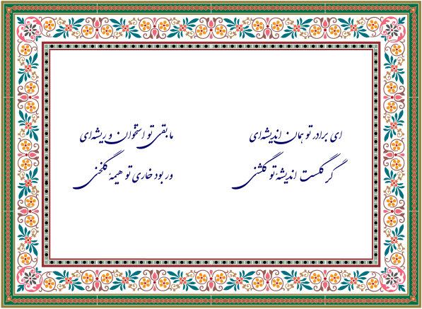

# MOST: Modern Open Scientific / Standard Templates
_The nearest star is 4.25 light-years from Earth which is why MOST wishes take at least 9 years to come true_ :) Nevertheless, we are searching for the *MOST*!

## َAbout
Welcome to __Modern Open Scientific / Standard Templates (MOST)__ repository. By submitting my M.Sc. thesis in 2018, I introduced a new latex template to perform writing and publishing **Persian thesis** in a standard and pretty style. 
Now, this repository consists of additional latex and Microsoft Office templates, including templates for technical reports, homework, and presentations. We decided to publish all of these templates on GitHub. 
Please send me your feedback and comments if you are using (Z)MOST templates.  

## Philosophy
Doing something is important, but delivering it is more important.
Fork the MOST and deliver *most* of the things that your audiences need!

## Getting started
Read documentations [https://m-zakeri.github.io/ZMOST](https://m-zakeri.github.io/ZMOST)

### Release 0.2.0
April 10, 2023

## Packages in MOST

### latex
Contains the Tex templates for writing theses, reports, homework, technical reports, and presentations.

#### IUST Thesis template
The main package in MOST is the IUST-Thesis template. It supports different types of theses, including the Ph.D. dissertation, M.Sc. thesis, and B.Sc. project.

##### How to compile?
Use the following command to create the PDF file for your thesis.

1. `git clone https://github.com/m-zakeri/ZMOST.git`

2. `cd ZMOST/latex/phd_msc_bsc_thesis/IUST_CE_Thesis_Template_Latex_G3`

3. `xelatex.exe -synctex=1 -interaction=nonstopmode "maintext.tex"`

4. `xindy -L persian-variant1 -C utf8 -I xindy -M "maintext".xdy -t "maintext".glg -o "maintext".gls "maintext".glo`

5. `xelatex.exe -synctex=1 -interaction=nonstopmode "maintext".tex`

##### Example thesis
Some sample theses using the IUST Thesis template are as follows:

* [https://github.com/m-zakeri/MSc](https://github.com/m-zakeri/MSc)

### word
Contains Microsoft Word templates for writing theses, reports, and seminars.

### powerpoint
Contains Microsoft PowerPoint templates for academic presentations.

